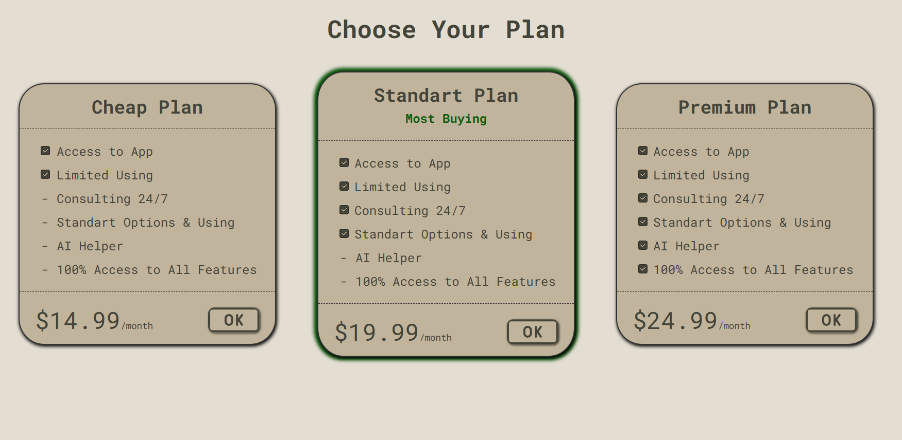

# 📝 Project Title



## 📌 About the Project
This is a small **HTML + CSS** website project created for practice.  
The main goal was to improve basic web development skills, work with Flexbox, and organize the project structure properly.

## ⚡ Features
- Clean file structure:  
  - `index.html` — main file  
  - `/css/style.css` — styles  
  - `/images` — images and preview  
- Built only with **pure HTML & CSS**, no extra libraries.  
- Responsive design (only for mobile devices in vertical position).  
- Includes a preview screenshot directly in the README.  

## 🚀 Getting Started
1. Clone the repository:
   ```bash
   git clone https://github.com/username/repo-name.git
   ```
2. Open index.html in your browser.
No additional dependencies required.

## 💡 What I Learned
- Working with Flexbox
- Structuring a simple project (html, css, images)
- Writing and styling a README file

⭐ If you like this project, feel free to give it a star on GitHub!

